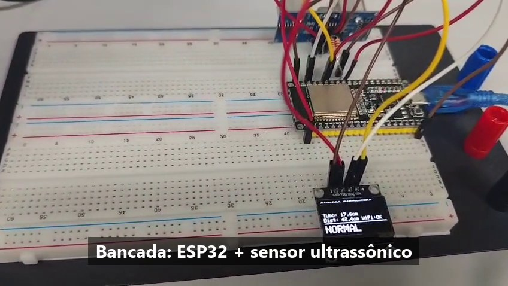
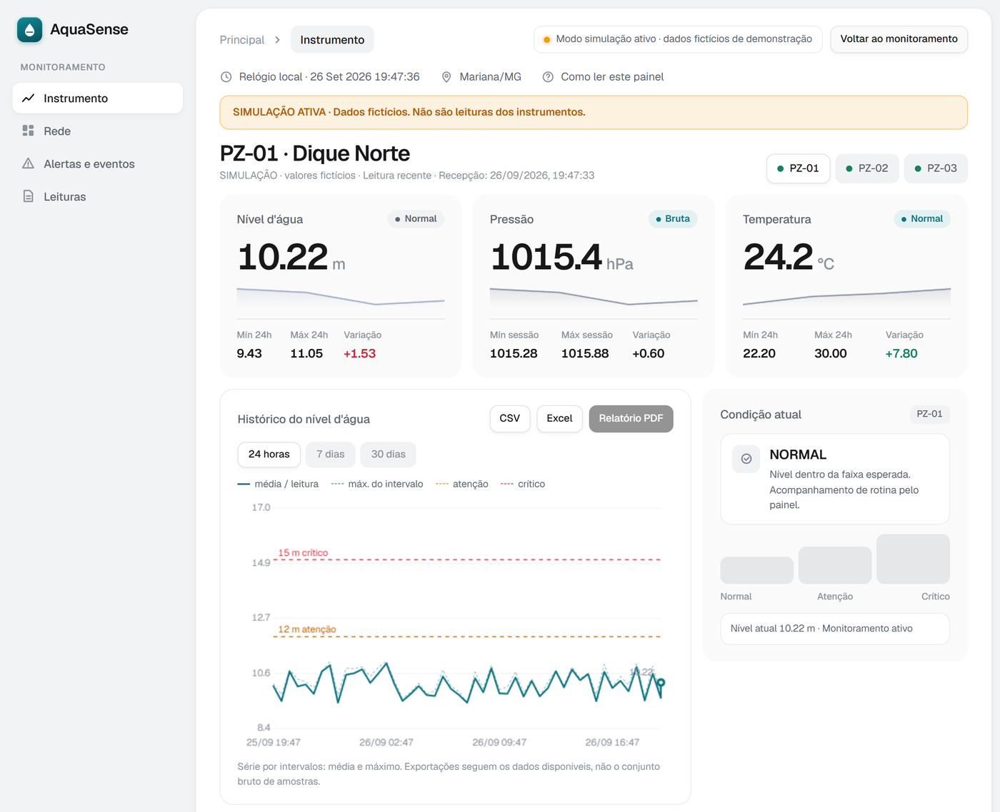
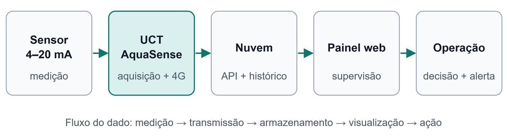
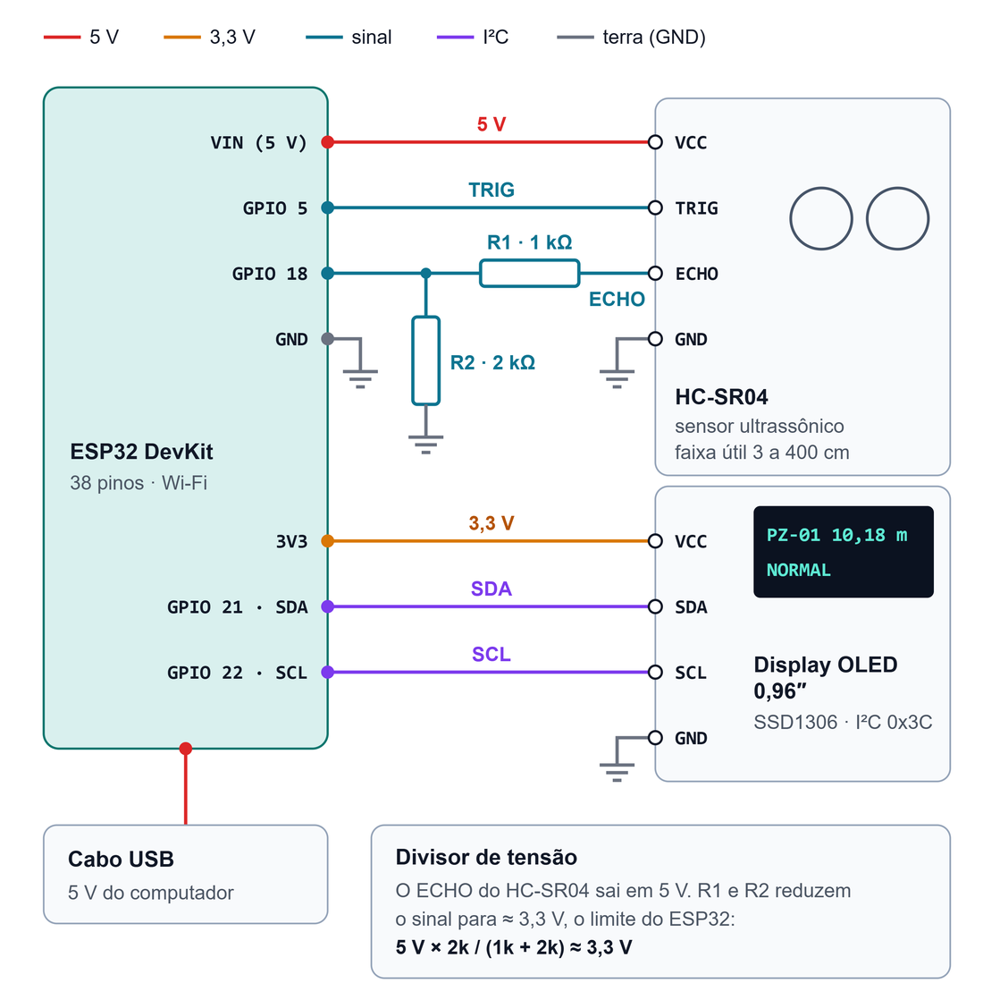

# AquaSense

Monitoramento remoto de piezômetros em barragens de mineração.
Trabalho de Conclusão do Curso Técnico em Automação Industrial — SENAI, Belo Horizonte, 2026.
Equipe: Isadora Muniz, Matheus Martins e Willian Lopes. Orientador: Prof. Jairo.

[](LICENSE)
[](https://willianlsz1.github.io/aquasense/)


| Protótipo V1 em bancada | Painel web (modo simulação, dados fictícios) |
|---|---|
|  |  |

## Problema

A leitura de piezômetros ainda é, em grande parte, manual: um técnico vai até cada
instrumento e mede o nível d'água. O processo custa caro, expõe a equipe a áreas de
risco e deixa intervalos sem informação entre as campanhas.

## Solução

Uma Unidade de Controle e Telemetria (UCT) mede o nível dentro do tubo, classifica
a condição (NORMAL, ATENÇÃO, CRÍTICO) e envia a leitura ao servidor. A nuvem guarda
o histórico e avalia alertas de nível, taxa de variação e perda de comunicação.
Um painel web mostra os pontos, gráficos, eventos e relatórios.



```
Sensor → ESP32 → HTTPS /ingest → Cloudflare Worker → D1 (leituras) + KV (alertas) → painel web
```

## Situação atual

| Etapa | Situação |
|---|---|
| Protótipo V1 — ESP32 + HC-SR04 em bancada, Wi-Fi | Validado em 12/09/2026 ([registro](docs/VALIDACAO_BANCADA_2026-09-12.md)) |
| Protótipo V2 — mesmo sistema num tubo de acrílico com água | Em montagem ([roteiro de ensaios](docs/ENSAIOS_V2.md)) |
| UCT comercial — sonda 4–20 mA, ADS1115, 4G, energia solar | Especificada no TCC; não montada |
| Servidor e painel | [Publicados](https://willianlsz1.github.io/aquasense/); 49 testes locais aprovados |

O V1 usa uma escala didática: a distância do sensor vira nível equivalente
(`max(0, 40 - distancia_cm) * 0,5`). Não é uma coluna real de vários metros nem
medição de poropressão. Os limites de 12 m e 15 m são de demonstração.
Estar publicado não garante disponibilidade contínua; a cota diária do D1 já
bloqueou consultas uma vez.

Detalhes, evidências e limites: [guia mestre](docs/GUIA_MESTRE.md).

## Comece aqui

### 1. Ver o painel

Abra o [painel publicado](https://willianlsz1.github.io/aquasense/). Sem leituras
recentes, os pontos aparecem como **SEM SINAL**. Para ver o painel funcionando sem
hardware, use **Iniciar simulação**: os dados são fictícios e a tela avisa isso.

### 2. Montar o protótipo V1

| Material | Qtd. |
|---|---|
| ESP32 DevKit (38 pinos) | 1 |
| Sensor ultrassônico HC-SR04 | 1 |
| Display OLED 0,96" SSD1306, I²C | 1 |
| Resistores de 1 kΩ e 2 kΩ (divisor do ECHO) | 1 de cada |
| Protoboard, jumpers e cabo USB | — |

Custo aproximado: R$ 150 a R$ 220. Ligações:



O ECHO do HC-SR04 sai em 5 V; o divisor de 1 kΩ / 2 kΩ reduz o sinal para cerca de
3,3 V, o limite das entradas do ESP32.

### 3. Gravar o firmware

1. Instale a [Arduino IDE](https://www.arduino.cc/en/software), o pacote de placas
   **esp32** (Espressif) e as bibliotecas **Adafruit SSD1306** e **Adafruit GFX**.
2. Copie `firmware/aquasense_hc_sr04/` para uma pasta **fora** do repositório e abra
   o `.ino` na IDE.
3. Na cópia, preencha Wi-Fi, endereço `/ingest`, chave do dispositivo e instrumento
   no início do arquivo. Não publique essa cópia: ela contém senha e chave.
4. Selecione **ESP32 Dev Module** e grave. No monitor serial (115200 baud) devem
   aparecer o nível, a faixa (NORMAL, ATENÇÃO ou CRÍTICO) e `HTTP 204` a cada envio.

Mais detalhes em [firmware/README.md](firmware/README.md).

### 4. Rodar os testes

Com Node.js 24, na raiz do repositório:

```bash
npm test
```

## Estrutura

| Pasta / arquivo | Conteúdo |
|---|---|
| `index.html`, `relatorio.html`, `assets/` | Painel web e relatório PDF (GitHub Pages) |
| `cloudflare-worker/` | API, motor de alertas, esquema e migrações do banco ([README](cloudflare-worker/README.md)) |
| `firmware/` | Firmware do protótipo e da UCT ([mapa dos arquivos](firmware/README.md)) |
| `tests/`, `tools/` | Testes automatizados e gerador do firmware de uma aba |
| `docs/` | Guia mestre, validação de bancada, ensaios do V2, critérios da interface e imagens |

## Manutenção

- Credenciais ficam na cópia local do firmware; nunca no Git.
- Um push em `main` publica o site e, se `cloudflare-worker/` mudar, o Worker
  (migrações antes).
- A API aceita apenas a origem do GitHub Pages; um servidor local pode receber
  bloqueio de CORS.
- Commits seguem `tipo(escopo): descrição`, em português e no imperativo. Tipos:
  `feat`, `fix`, `docs`, `test`, `refactor`, `perf`, `chore`. Escopos usuais:
  `firmware`, `dashboard`, `worker`, `docs`. Exemplo:
  `fix(dashboard): mostra SEM SINAL quando a API está indisponível`.

O texto completo do TCC e os documentos internos da equipe ficam fora do repositório.

## Licença

[MIT](LICENSE) © 2026 Isadora Muniz, Matheus Martins e Willian Lopes.
