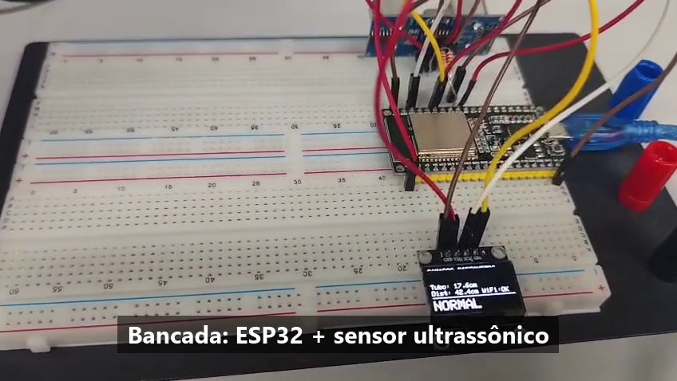
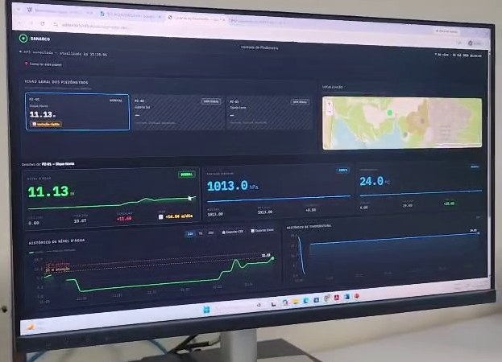

# 🟢 AquaSense — Monitoramento Online de Piezômetros

**AquaSense** é o sistema de **monitoramento contínuo do nível de água em piezômetros de barragens** desenvolvido como TCC do Técnico em Automação Industrial (SENAI Belo Horizonte HORTO), em resposta ao desafio SAGA da **Samarco Mineração**: sensores no ESP32, transmissão em tempo real para o Cloudflare Worker (com armazenamento em D1), dashboard interativo no GitHub Pages e alertas escritos e visuais.

| Protótipo de bancada | Dashboard ao vivo durante a demonstração |
|:---:|:---:|
|  |  |

> 🎬 Demonstração completa em vídeo (bancada → firmware → dashboard atualizando ao vivo): publicada no [LinkedIn](https://www.linkedin.com/in/willianlopeshvac/).

## Estado do projeto (julho/2026)

- ✅ **Plataforma em produção:** Worker + D1 + KV no ar, dashboard publicado, eventos persistentes disponíveis para consulta/auditoria e deploy automático no merge da `main`.
- ✅ **Protótipo físico de bancada validado ponta a ponta** (16/07): ESP32 + sensor ultrassônico + OLED lendo nível real e o dashboard atualizando ao vivo, com *store & forward* comprovado (leituras seguradas sem rede, zero perda).
- ✅ **Demonstração em vídeo gravada** (28/07): cadeia completa em funcionamento — bancada, display local, firmware e dashboard registrando a subida do nível em tempo real (imagens acima).
- ✅ **TCC oficial** entregue sobre o template INTEGRA SENAI-MG.
- 🔜 **Protótipo v2 em preparação:** tubo de acrílico simulando o piezômetro + sensor de pressão piezorresistivo (MPS20N0040D + HX710B) + display maior (TFT) — o firmware já foi preparado para essas trocas (interface `Tela` e adapters de sensor enxutos).
- 🔜 Ensaio de validação do sensor e cadastro de `DEVICE_KEYS` por dispositivo em produção.

---

## 📋 Índice

- [Visão Geral](#visão-geral)
- [Arquitetura do Sistema](#arquitetura-do-sistema)
- [Tecnologias Utilizadas](#tecnologias-utilizadas)
- [Pré-requisitos](#pré-requisitos)
- [Configuração e Deploy](#configuração-e-deploy)
  - [1. Backend (Cloudflare Worker + D1)](#1-backend-cloudflare-worker--d1)
  - [2. Firmware ESP32 (Wokwi)](#2-firmware-esp32-wokwi)
  - [3. Dashboard (GitHub Pages)](#3-dashboard-github-pages)
- [Variáveis de Ambiente](#variáveis-de-ambiente)
- [Alertas escritos e visuais](#alertas-escritos-e-visuais)
- [Níveis de Alerta](#níveis-de-alerta)
- [Estrutura do Projeto](#estrutura-do-projeto)
- [Histórico de Arquitetura](#histórico-de-arquitetura)
- [Segurança](#segurança)
- [Autor](#autor)

---

## Visão Geral

O sistema monitora continuamente o piezômetro via ESP32 — **na bancada física** (sensor ultrassônico medindo nível real, OLED local) **ou na simulação Wokwi** (BMP180 como stand-in) — enviando **nível d'água (m)**, pressão e temperatura para o Cloudflare Worker a cada 10 segundos, com *store & forward*: leituras feitas sem rede ficam retidas em buffer local (com timestamp NTP) e são reenviadas quando a conexão volta, sem perda de dados.

Um dashboard web exibe os dados em tempo real com histórico de 24 horas, indicadores visuais de alerta e eventos da sessão atual. O **motor de alertas** do Worker (executado por *cron trigger*, a cada 1 minuto) vigia o D1 e grava no KV as transições de faixa, expostas por `GET /alerts` para consulta e auditoria. O dashboard atual não carrega esse histórico após recarregar a página. No hardware, LEDs e buzzer sinalizam localmente a faixa de nível; sem conexão, o painel indica **SEM SINAL** em vez de inventar uma condição normal.

Quando o backend não está acessível, o dashboard ativa automaticamente um **modo de simulação** para demonstração — sinalizado por um banner amarelo e pela marcação "(simulação)" nos eventos, para que dados fictícios nunca sejam confundidos com leituras reais.

> ⚠️ **Posicionamento do protótipo (Fase 1):**
> - O protótipo de bancada usa **sensores stand-in** (ultrassônico HC-SR04/JSN-SR04T na bancada; BMP180 no Wokwi, com escala didática de **10 hPa = 1 m**). Na **UCT industrial (Fase 2)**, o sinal vem de um **transdutor piezorresistivo submersível 4–20 mA** lido por um ADS1115, com comunicação celular 4G (SIM7600) e alimentação solar — o protótipo representa o conceito; o produto é a especificação completa.
> - A lógica de alerta já é a **correta para piezômetro**: nível d'água **alto** = perigo (saturação do maciço).

---

## Arquitetura do Sistema

```
┌──────────────────────┐
│ ESP32 + sensor       │
│ (bancada física com  │
│  OLED, ou Wokwi)     │
└────────┬─────────────┘
         │
  POST /ingest (JSON, x-device-key)
         │
┌────────▼───────────────┐
│   Cloudflare Worker     │
│   (ingestão + /ultimos  │
│    + /dados + cron de   │
│    registro de alertas) │
└─────┬──────────────┬────┘
      │              │
  INSERT (D1)   GET /ultimos, /dados
      │              │
┌─────▼────────┐ ┌───▼───────────────┐
│ Cloudflare D1 │ │   GitHub Pages     │
│ (SQLite)      │ │   index.html       │
│               │ │   (Dashboard)     │
└───────────────┘ └───────────────────┘
```

**Por que o Worker no meio?**
O ESP32 nunca fala direto com o banco: ele posta as leituras em `/ingest`, autenticando com a `DEVICE_KEY` no header `x-device-key`. É o Worker quem grava no D1. O dashboard, por sua vez, só lê — via `GET /ultimos` (última leitura de cada piezômetro) e `GET /dados` (série histórica agregada para os gráficos). Nenhum segredo de banco fica exposto no firmware nem no HTML público: o Worker guarda tudo em *secrets* do Cloudflare, fora do repositório.

---

## Tecnologias Utilizadas

| Camada | Tecnologia |
|--------|-----------|
| Firmware | C++ (Arduino), ESP32, núcleo comum + adapters de sensor (HC-SR04/JSN-SR04T na bancada, BMP180 no Wokwi, ADS1115 4–20 mA na UCT), OLED atrás da interface `Tela`, store & forward com NTP |
| Simulação | [Wokwi](https://wokwi.com) |
| Backend | [Cloudflare Workers](https://workers.cloudflare.com) (ingestão + leitura + motor de alertas via Cron Trigger) |
| Banco de dados | [Cloudflare D1](https://developers.cloudflare.com/d1/) (SQLite gerenciado) |
| Estado do motor de alertas | [Cloudflare Workers KV](https://developers.cloudflare.com/kv/) |
| Alertas | Eventos persistentes no KV, consultáveis em `GET /alerts`; indicadores visuais e eventos locais da sessão no dashboard; LEDs e buzzer no protótipo físico |
| Dashboard / Frontend | HTML + CSS + Canvas API + Leaflet (mapa), export CSV/Excel com metadados de auditoria |
| Hospedagem frontend | [GitHub Pages](https://pages.github.com) |

---

## Pré-requisitos

- Conta na [Cloudflare](https://dash.cloudflare.com) (plano gratuito) com Workers, D1 e KV habilitados
- [wrangler](https://developers.cloudflare.com/workers/wrangler/) instalado (`npm i -g wrangler`)
- GitHub Pages habilitado no repositório
- (Opcional) Conta no [Wokwi](https://wokwi.com) para simular o ESP32

---

## Configuração e Deploy

### 1. Backend (Cloudflare Worker + D1)

O backend inteiro (ingestão, leitura para o dashboard e motor de alertas) roda em [`cloudflare-worker/`](cloudflare-worker/). Resumo do fluxo — o passo a passo completo, com todos os comandos, está no [`cloudflare-worker/README.md`](cloudflare-worker/README.md):

1. `wrangler login`
2. Criar o namespace KV do motor de alertas (`wrangler kv namespace create ALERT_STATE`) e colar o `id` em `wrangler.toml`
3. Criar o banco D1 (`wrangler d1 create piezometro-db`), colar o `database_id` em `wrangler.toml` e aplicar `schema.sql`
4. Definir o segredo `DEVICE_KEY` com `wrangler secret put`
5. Ajustar as variáveis não sensíveis em `[vars]` (ver [tabela abaixo](#variáveis-de-ambiente))
6. `wrangler deploy` — a URL pública fica algo como `https://piezometro-worker.SEU-SUBDOMINIO.workers.dev`

---

### 2. Firmware ESP32

O firmware é organizado em **núcleo comum + adapters**: `piezometro_core.h` concentra WiFi/NTP/buffer/envio/alertas; cada sketch `.ino` implementa só a leitura do seu sensor; a tela fica atrás da interface `Tela` (`tela.h`), com o OLED SSD1306 como adapter concreto (`tela_ssd1306.h`) — trocar de display (ex.: TFT) não toca no core nem nos sketches.

**Bancada física** (`sketch_fisico_jsn_sr04t.ino`, `sketch_demo_hc_sr04.ino` ou `sketch_uct_4a20ma.ino`):

1. Copie `firmware/piezometro_config_local.h.example` para `piezometro_config_local.h` (mesma pasta, sem o `.example`) e preencha WiFi, endpoint do Worker, `DEVICE_KEY` e `PIEZOMETRO_ID`. Esse arquivo está no `.gitignore` — **nunca é commitado**.
2. Abra o sketch no Arduino IDE com as abas `piezometro_core.h`, `tela.h`, `tela_ssd1306.h` e `piezometro_config_local.h` na mesma pasta.
3. Grave na placa (nesta placa clone: segurando o botão **BOOT** durante o upload).

**Simulação Wokwi** (`sketch.ino`, BMP180 como stand-in):

1. Acesse [wokwi.com](https://wokwi.com), crie um projeto ESP32 e cole `firmware/sketch.ino` (e o `firmware/diagram.json` na aba **diagram.json** para montar o circuito: BMP180 na I2C 21/22, LEDs 32/33/25, buzzer 26)
2. As credenciais do Wokwi já vêm inline no sketch (`Wokwi-GUEST` é rede pública do simulador) — ajuste só `SERVER_URL` e `DEVICE_KEY`
3. **Start Simulation** — para testar alertas, mova o slider de pressão do BMP180: **1013 hPa → 10,0 m** 🟢 · **1035 hPa → 12,2 m** 🟡 · **1065 hPa → 15,2 m** 🔴. Observe os LEDs e o buzzer locais, os indicadores do dashboard e o registro persistente em `GET /alerts`.

> A placa posta as leituras (JSON) no `/ingest`, autenticando com `DEVICE_KEY` no header `x-device-key`. Os limiares (atenção 12 m / crítico 15 m) são espelhados no Worker (`[vars]` do `wrangler.toml`) e no dashboard — que os busca do Worker via `GET /config` no boot.

---

### 3. Dashboard (GitHub Pages)

1. No arquivo `assets/js/config.js`, atualize a URL do backend para o Worker publicado (endpoints `/ultimos`, `/dados`, `/alerts`, `/config`):

```javascript
const API_URL = "https://piezometro-worker.SEU-SUBDOMINIO.workers.dev";
```

2. Habilite o GitHub Pages:
   - Vá em **Settings → Pages**
   - Source: **Deploy from a branch → main**
   - Salve

3. O dashboard estará disponível em:
   ```
   https://SEU-USUARIO.github.io/aquasense
   ```

---

## Variáveis de Ambiente

Definidas em `cloudflare-worker/wrangler.toml`, no bloco `[vars]` (não sensíveis, ficam no repositório):

| Variável | Descrição | Exemplo |
|----------|-----------|---------|
| `ALLOWED_ORIGIN` | Origem permitida pelo CORS (sem barra final) | `https://willianlsz1.github.io` |
| `NIVEL_ATENCAO` | Limiar de atenção do nível d'água (m) | `12` (padrão) |
| `NIVEL_CRITICO` | Limiar crítico do nível d'água (m) | `15` (padrão) |
| `ALERT_REPEAT_MIN` | Reavaliação periódica do alerta crítico enquanto persistir (min) | `15` (padrão) |

Segredos (definidos via `wrangler secret put`, **nunca** no `wrangler.toml`):

| Segredo | Descrição |
|---------|-----------|
| `DEVICE_KEY` | Chave que a placa envia no header `x-device-key` ao chamar `/ingest` (único obrigatório na prática) |

---

## Alertas escritos e visuais

O motor de alertas do Worker roda como **Cron Trigger** (`* * * * *`, a cada 1 minuto), busca o último `nivel_agua` de cada piezômetro no D1 e registra as transições de faixa. O estado (última faixa e histórico de eventos) fica persistido no **Workers KV**, já que um Worker não mantém estado entre invocações. O histórico escrito é exposto em `GET /alerts` para consulta e auditoria; o dashboard atual não o hidrata após reload e mostra apenas estados ao vivo e eventos locais da sessão.

O sistema monitora **múltiplos piezômetros**: cada leitura carrega o identificador do instrumento (campo `piezometro`, ex. `PZ-01`), gravado junto com a medição no D1. O motor acompanha cada piezômetro separadamente; o histórico em `GET /alerts` indica qual instrumento mudou de faixa. O id é configurado no firmware através da constante `PIEZOMETRO_ID`.

---

## Níveis de Alerta

O sistema classifica o **nível d'água** em três faixas — a mesma lógica no firmware (LEDs/buzzer), no dashboard (badges/gráfico) e no motor de alertas do Worker:

| Nível | Condição | LED | Buzzer | Registro no painel |
|-------|----------|-----|--------|-------------|
| 🟢 **Normal** | Nível < 12 m | Verde contínuo | Silencioso | Evento persistente para auditoria e estado visual normal ao vivo |
| 🟡 **Atenção** | 12 ≤ Nível < 15 m | Amarelo contínuo | 1 bip a cada 2s | Evento persistente para auditoria e destaque visual ao vivo |
| 🔴 **Crítico** | Nível ≥ 15 m | Vermelho piscando | Bips contínuos | Evento persistente para auditoria e destaque visual ao vivo |

> ✅ Lógica correta de piezômetro: nível d'água **alto** = perigo (saturação do maciço da barragem).

---

## Estrutura do Projeto

```
aquasense/
├── firmware/
│   ├── piezometro_core.h             # Núcleo comum (WiFi, NTP, buffer, envio, alertas)
│   ├── tela.h                        # Interface Tela — core e sketches só falam com ela
│   ├── tela_ssd1306.h                # Adapter concreto do OLED SSD1306 (um futuro TFT entra aqui do lado)
│   ├── piezometro_config_local.h.example  # Modelo de credenciais/limiares (copiar sem .example; fora do git)
│   ├── piezometro_deep_sleep.h       # Modo de campo a bateria/solar (opt-in via MODO_DEEP_SLEEP)
│   ├── sketch.ino                    # Adapter do sensor da SIMULAÇÃO (BMP180 como stand-in; credenciais Wokwi inline)
│   ├── sketch_fisico_jsn_sr04t.ino   # Adapter do sensor do PROTÓTIPO FÍSICO (JSN-SR04T)
│   ├── sketch_demo_hc_sr04.ino       # Adapter da DEMO de bancada sem água (HC-SR04; mão = água)
│   ├── sketch_uct_4a20ma.ino         # Adapter da UCT INDUSTRIAL (ADS1115 + loop 4–20 mA, NAMUR)
│   └── diagram.json                  # Circuito do Wokwi (ESP32 + BMP180 + OLED + LEDs + buzzer)
├── docs/
│   ├── GUIA_MESTRE.md                   # Guia geral do projeto
│   ├── PESQUISA_EXTERNA_PIEZOMETROS.md  # Pesquisa externa sobre piezômetros
│   └── img/                             # Fotos do protótipo e da demonstração
├── cloudflare-worker/       # Backend (deploy: ver README da pasta)
│   ├── src/
│   │   ├── index.js         # Roteador (fetch + scheduled) — só orquestra
│   │   ├── config.js        # getConfig, ranges e constantes
│   │   ├── http.js          # CORS, respostas JSON, limites de payload
│   │   ├── db.js            # Todas as queries do D1
│   │   ├── alertas.js       # Motor de alertas (nível + comunicação + taxa) e estado no KV
│   │   ├── eventos.js        # Registro de eventos persistentes no KV
│   │   ├── retencao.js      # Retenção: consolidação diária + limpeza (cron)
│   │   └── rotas.js         # Handlers dos endpoints
│   ├── migrations/          # Migrações do D1 (0001 recebido_em · 0002 dedupe · 0003 retenção)
│   ├── schema.sql           # Schema da tabela `leituras` (D1)
│   ├── wrangler.toml        # Config (vars, D1, KV, cron)
│   └── README.md            # Guia de deploy passo a passo
├── assets/
│   ├── styles.css           # Todo o CSS do dashboard
│   └── js/                  # Dashboard em módulos (carregados em ordem de dependência)
│       ├── config.js        # API_URL, CFG, catálogo, loadConfig (/config)
│       ├── util.js          # Funções puras (classificação, histerese, formatação)
│       ├── fontes.js        # Seam de dados: FonteApi / FonteSimulada / trocarFonte
│       ├── estado.js        # Estado do painel (séries, stats, alarmes/eventos)
│       ├── graficos.js      # Canvas: sparklines e gráfico principal (média + máx)
│       ├── paineis.js       # Cards, mapa, painel de alerta, tabelas
│       ├── exportar.js      # Export CSV (com metadados de auditoria)
│       ├── exportar_xls.js  # Export Excel formatado (SpreadsheetML)
│       └── app.js           # Orquestração: poll, seleção, boot
├── index.html               # Dashboard web — só a estrutura HTML (GitHub Pages)
└── readme.md                # Este arquivo
```

---

## Histórico de Arquitetura

A primeira versão do sistema (v1) usava um proxy Node.js (`server.js`) hospedado no Render, que ingeria as leituras do ESP32, repassava as consultas do dashboard ao InfluxDB Cloud e rodava o motor de alertas via `setInterval`. Essa arquitetura foi substituída (v2) pelo Cloudflare Worker descrito neste documento, por três motivos principais: o plano gratuito do Render hibernava após 15 minutos de inatividade, o que pausava o motor de alertas justamente quando ninguém estava olhando o dashboard (o pior momento para isso acontecer); o InfluxDB Cloud exigia gerenciar tokens de leitura/escrita separados e, em contas novas, tinha retenção de dados limitada a 30 dias no plano gratuito; e manter três serviços externos (Render, InfluxDB, GitHub Pages) para um protótipo de TCC adicionava complexidade operacional sem benefício correspondente.

A v2 consolida ingestão, armazenamento e motor de alertas em uma única plataforma (Cloudflare), sem credenciais externas de banco de dados: o D1 tem retenção ilimitada dentro do limite de armazenamento do free tier (~5 GB, suficiente para anos de leituras de piezômetro), não exige nenhum token de acesso ao banco (o binding é interno ao Worker) e o motor de alertas, agora um Cron Trigger, nunca hiberna. A v1 não foi apagada do projeto — ela está preservada no histórico do git, disponível para consulta caso seja necessário comparar as duas abordagens.

---

## Segurança

- Nenhum segredo fica no repositório: `DEVICE_KEY` é definido com `wrangler secret put`; no firmware, as credenciais reais vivem em `piezometro_config_local.h`, que está no `.gitignore`.
- O ESP32 autentica cada envio com a `DEVICE_KEY` no header `x-device-key`; o dashboard é somente leitura e o CORS restringe a origem.
- Índice único no D1 impede duplicatas em caso de reenvio do buffer (*store & forward*).

## Autor

**Willian Lopes da Rocha** — Técnico em Automação Industrial em formação (SENAI) e Mecânico de Refrigeração II, com atuação em manutenção hospitalar de sistemas HVAC de grande porte.

- LinkedIn: [linkedin.com/in/willianlopeshvac](https://www.linkedin.com/in/willianlopeshvac)
- Este projeto responde ao desafio SAGA (SENAI/Samarco). Feedback técnico é bem-vindo — abra uma *issue* ou comente nos posts da série no LinkedIn.

> ⚠️ **Posicionamento honesto:** este é um protótipo de conceito construído por um estudante, não um produto certificado para uso em barragens reais. A instrumentação de estruturas com Dano Potencial Associado alto exige equipamento qualificado e responsabilidade técnica formal (Resolução ANM 95/2022). O objetivo do projeto é demonstrar a arquitetura e democratizar o conceito para estruturas hoje sem nenhum monitoramento.
